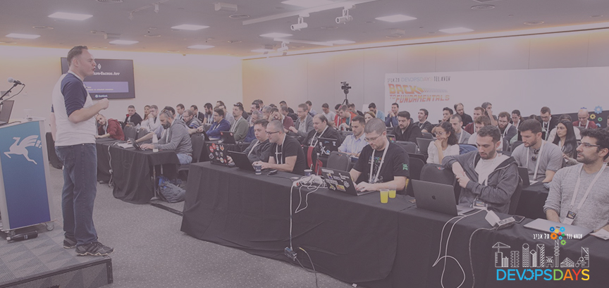

# DEV Community TLV
Welcome to the Tel Aviv community site that supports the events [DevOpsDaysTLV]({{ site.devopsdays_url }}), [StatsCraft]({{ site.statscraft_url }}), [Cloud Native Day Tel Aviv]({{ site.cloudnative_url }}), [DevSecCon Tel Aviv]({{ site.devseccon_url }}), and [DevRel_IL](https://www.meetup.com/DevRel/)

# What You'll Find

This site was setup to aggregate information from all of these communities, but youa are also welcome to join the newly launched [Discord Server]({{ site.discord_url }}) for our community to chat with your peers from the local community.  If you are planning on visiting in Tel Aviv, or attending one of these events, this would be a great place to get to know folks from the local community.

# Issues

If you would like to report an issure or problem, you can contact us through the form on the site, and we will be sure to get in touch with.

# Code of Conduct
We expect all the participants in our community to abide by our code of conduct, and treat all of the community members with respect and kindness.  We will not tolerate harrassment of any kind.

# Credits

Big thanks to the awesome "Forty" theme by [HTML5 UP](https://html5up.net/).  

Repository [Jekyll logo](https://github.com/jekyll/brand) icon licensed under a [Creative Commons Attribution 4.0 International License](http://choosealicense.com/licenses/cc-by-4.0/).
