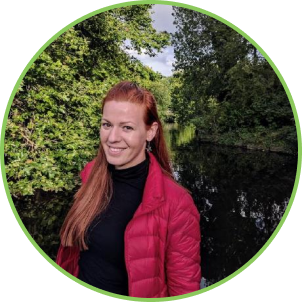
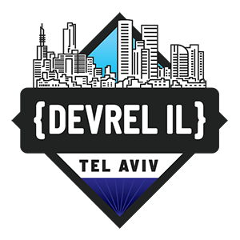

	<h3></h3>
		
&nbsp;&nbsp;&nbsp;&nbsp;&nbsp;&nbsp;&nbsp;&nbsp;&nbsp;&nbsp;&nbsp;&nbsp;&nbsp;&nbsp; &nbsp;&nbsp;

 <ul class="actions">
                    <li><a href="sponsor.html" class="button next">LEARN MORE</a></li>
                </ul>

 
 

	
    <header class="major">
    <h1>2020 Event Speakers</h1>
    </header>
	<h3>Keynote & Spotlight Speakers</h3>
    

    

        

        

        <strong>KEYNOTE</strong>

        

        <ul class="icons">AVISHAI ISH-SHALOM   SCYLLADB  
        <li></li>
        <li></li>
        <li></li></ul>

        

        
<a href="#" title="Close" class="modal-close">X</a>
        <h4>KEYNOTE: THE WORLD HAS CHANGED - HAVE OUR DESIGNS?</h4>
        
ABSTRACT

        
<small>When we build systems our design and tradeoffs reflect the different scales of the system: the speed of disks, latency of network; They reflect the constraints and abilities of the underlying technologies. But as technology advances some of these assumptions have become invalid. We are no longer running on physical machines for which RDBMS systems were designed; SSD changed pretty much everything in the storage world, but our software was designed for magnetic disks; NVRAM? O/S design is way off. This talk will show how changes in hardware technologies impact design rational of various systems, highlighting the importance of understanding and rethinking the design rational and explore new designs that arise from the new rational.</small>

        

        
  

        

        

         <strong>KEYNOTE</strong>

        
        <ul class="icons">EINAT ORR   TREEVERSE  
        <li></li>
        <li></li>
        <li></li></ul>
        
          <!-- 

        
<a href="#1" title="Close" class="modal-close">X</a>
        <h4>KEYNOTE: DO YOU REALLY MEASURE WHAT YOUR USERS EXPERIENCE?</h4>
        
THIS TALK WILL BE GIVEN IN HEBREW

        
<small>The system is slowing down, the customers are becoming frustrated, but our monitoring shows all green. Everyone handles performance issues, but how do we measure it properly? Are you really measuring what your users experience? Is it possible to measure everything? In my presentation, I will walk you through some of the blind spots we all have in our monitoring systems, and share from my own experience of dealing with performance issues.</small>

        

        
  -->
        
        
        

        

         <strong>KEYNOTE</strong>

        
        <ul class="icons">CARMIT DANON   TERASKY  
        <li></li>
        </ul>
        
          

        
<a href="#2" title="Close" class="modal-close">X</a>
        <h4>KEYNOTE: DO YOU REALLY MEASURE WHAT YOUR USERS EXPERIENCE?</h4>
        
THIS TALK WILL BE GIVEN IN HEBREW

        
<small>The system is slowing down, the customers are becoming frustrated, but our monitoring shows all green. Everyone handles performance issues, but how do we measure it properly? Are you really measuring what your users experience? Is it possible to measure everything? In my presentation, I will walk you through some of the blind spots we all have in our monitoring systems, and share from my own experience of dealing with performance issues.</small>

        

        
  
               
        

        

		

        

        <strong>RANT SESSION</strong>

        
        <ul class="icons">COREY QUINN   DUCKBILL GROUP  
        <li></li>
        <li></li>
        <li></li>
        </ul>

        <!-- 
<ul class="icons">COREY QUINN | DUCKBILL GROUP  <li></li><li></li><li></li></ul>

        
<ul class="icons">COREY QUINN | DUCKBILL GROUP  <li></li><li></li><li></li></ul>
 -->
		
       
     

  
 

 
<h3>Mini-Track Speakers - DevOpsDays Tel Aviv</h3>
         

        

        
        <ul class="icons">HEIDI WATERHOUSE LAUNCH DARKLY 
        <li></li>
        <li></li>
        <li></li>
        </ul>
        
        

        
<a href="#6" title="Close" class="modal-close">X</a>
        <h4>THE DEVIL'S DEVOPS</h4>
        
IGNITE

        
<small>An Ignite that plays off Ambrose Bierce’s The Devil’s Dictionary to present satirical and painfully true definitions of words you hear at conferences all the time.  
        Satire is only funny if it’s true. Join me for an Ignite defining everyday devops words in the most pointed way possible.</small>

        

        
 
        
        
        

		

        
        <ul class="icons">DOTAN HOROVITS   LOGZ.IO  
        <li></li>
        <li></li>
        <li></li>
        </ul>
        
        

        
<a href="#7" title="Close" class="modal-close">X</a>
        <h4>THE STATE OF DEVOPS IN 2020</h4>
        
IGNITE

        
<small>There are many opinions on DevOps, open source, and cloud-native tech, but what is actually being practiced? What can we learn from the collective experience of the community? We went and surveyed over 1000 engineers across the globe about their DevOps practices, challenges, and more, with special focus on cloud native and observability. This session will share data and insights from the survey, with key trends (compared to previous years’ DevOps Pulse surveys), points of interest, and challenges that developers experience on a daily basis. This session will help you learn from the collective experience and emerging best practices in the community, to help guide decisions on processes, tooling and architecture choices.</small>

        

        
 
        
        

        

        
        <ul class="icons">MICHAEL ZION   APPSFLYER  
        <li></li>
        <li></li>
        <li></li>
        </ul>
        
        

        
<a href="#8" title="Close" class="modal-close">X</a>
        <h4 style="text-transform: uppercase;">Waste-Oriented, Hunch-Based Web Architecture</h4>
        
IGNITE

        
<small>Promoting a whole new architecture and philosophy requires the right tooling, and this is exactly what I want to talk about. <a href="https://github.com/wohb/okify" target="_blank">Okify</a> is a CLI that helps software engineers prioritise feelings over production by ignoring errors. <a href="https://github.com/wohb/singload" target="_blank">Singload</a> is a load-balancer that helps software engineers reduce system complexity at all costs by routing traffic to just 1 node. In my talk I will dive into using those tools, and how they promote waste-oriented, hunch-based web architectures.</small>

        

        
 
                       
        

        

        
        <ul class="icons">ROBERT BARRON   IBM  
        <li></li>
        <li></li>
        <li></li>
        </ul>
         

        
<a href="#9" title="Close" class="modal-close">X</a>
        <h4 style="text-transform: uppercase;">Obviously a major malfunction... Lessons 35 years after the Challenger Disaster</h4>
        
IGNITE

        
<small>The Challenger launched for the last time on January 28th, 1986. It never reached orbit. The Challenger disaster was not only a failure of the technology, but a failure of the engineering and management culture in NASA. While engineers were aware of problems in the technology stack, there was no conception of the risks they actually posed to the spacecraft. Management had shifted the focus from “prove that it’s safe to launch” to “prove that it’s unsafe to stop the launch”. This session will present the risk analysis (or lack thereof) of the Shuttle program and draw parallels to modern software development. In the end, launching a shuttle is an extremely complex deployment to the cloud… and above it.</small>

        

        
 
        
        

       

        
       <ul class="icons">JULIA SHUB   LAWGEEX  
       <li></li>
       <li></li>
       <li></li>
       </ul>
       
        

        
<a href="#10" title="Close" class="modal-close">X</a>
        <h4 style="text-transform: uppercase;">Pregnancy - Nature's CI/CD</h4>
        
IGNITE

        
<small>So you and your partner decide to have a child. From this point onwards, you can treat it as a CICD project since it’s basically the same.  This is going to be a satirical talk ridiculing my current state of pregnancy as an SRE (month No. 9 at the time of the conf).</small>

        

        
 
              
       

     

  
 

 
<h3>Mini-Track Speakers - Cloud Native & OSS IL</h3>
         

        

        
        <ul class="icons">NIR YECHIEL   RED HAT  
        <li></li>
        <li></li>
        <li></li>
        </ul>
        
        

        
<a href="#12" title="Close" class="modal-close">X</a>
        <h4 style="text-transform: uppercase;">Submariner: multi-cluster networking for Kubernetes</h4>
        
IGNITE

        
<small>With standard Kubernetes networking, connectivity is limited to a single cluster only, requiring proxies to connect workloads across clusters for migration, disaster-recovery, or geographic locality. Submariner is an open source project that enables high-performance cross-cluster connectivity and Service Discovery between different Kubernetes clusters, either on-premises or in the cloud. With Submariner, your applications and services can span multiple cloud providers, datacenters, and regions.</small>

        

        
        
        
        

		

        
        <ul class="icons">RONEN LEVINSON   SISENSE  
        <li></li>
        <li></li>
        <li></li>
        </ul>
        
        

        
<a href="#13" title="Close" class="modal-close">X</a>
        <h4 style="text-transform: uppercase;">k3s: From Development to Production at the speed of light</h4>
        
IGNITE

        
<small>With Kubernetes becoming the standard container orchestration tool, we got to a point in which apps are deployed and managed in the same ecosystem for different purposes. As a result, the number of Kubernetes distributions started to rise in order to deal with different scenarios. To name a few: OpenShift, RKE, Tanzu… K3s is one of the newest distributions made by Rancher, which is an open source project that recently joined the list of CNCF Sandbox projects. The main goal of K3s is providing a lightweight k8s distribution using a single binary, while reducing the memory consumed by the orchestration tool.In this lightning talk we will discuss what k3s is, compare it to k8s and see how it can be installed for different purposes: CI, Edge, development and production.</small>

        

        
   
        
        
        

        

        
        <ul class="icons">BOAZ ZINIMAN   AWS  
        <li></li>
        <li></li>
        <li></li>
        </ul>
        
        

        
<a href="#13" title="Close" class="modal-close">X</a>
        <h4 style="text-transform: uppercase;">Being good neighbors - Rate limiting in a serverless world</h4>
        
IGNITE

        
<small>How do you avoid DDoSing other systems or running out of resources when developing serverless applications? Serverless cloud based applications bring new challenges with their architecture and scaling capabilities. In a perfect world, this should be an advantage only, but we all know by now, that the world ain’t perfect. Integrating serverless with non-serveless systems is a challenge you should take into account and plan accordingly. This session will focus on why rate limiting is so important in serverless systems and how you should design a better system that acts as a better neighbors.</small>

        

        
   
        
        
        

        <!-- 
<ul class="icons">COREY QUINN | DUCKBILL GROUP  <li></li><li></li><li></li></ul>

        
<ul class="icons">COREY QUINN | DUCKBILL GROUP  <li></li><li></li><li></li></ul>

        
<ul class="icons">COREY QUINN | DUCKBILL GROUP  <li></li><li></li><li></li></ul>
 -->

     

  
 

 
<h3>Mini-Track Speakers - Statscraft</h3>

        

        
        <ul class="icons">JASON YEE   GREMLIN  
        <li></li>
        <li></li>
        <li></li>
        </ul>
        
         

        
<a href="#18" title="Close" class="modal-close">X</a>
        <h4 style="text-transform: uppercase;">SLOs: You're missing the point</h4>
        
IGNITE

        
<small>Innovation is how you win customers; reliability is how you keep them. To succeed, you need both. But as organizations adopt Service Level Objectives (SLOs) as part of their Site Reliability Engineering (SRE) practices, they become fixated on reliability and innovation suffers. In this talk, I’ll discuss why you need to spend more time on innovation and how to do it. I’ll also share how you can escape your everyday toil and stressful firefighting to rediscover the fun in engineering—and help your company succeed at the same time!</small>

        

        
   
        
        
        

        

        
        <ul class="icons">NATI COHEN    
        <li></li>
        <li></li>
        <li></li>
        </ul>
        
         

        
<a href="#18" title="Close" class="modal-close">X</a>
        <h4 style="text-transform: uppercase;">5 Monitoring Anti-Patterns (and how to avoid them)</h4>
        
IGNITE

        
<small>During the past 15 years I was lucky to partake in building and monitoring various production systems. However, while sometimes the monitors and alerts we created were spot-on, and helped us mitigate future failures quickly, other times the dashboards we created were simply useless, and the alerts did nothing but make us miserable. In this talk we will review several common monitoring mistakes my peers and I repeatedly tend to lean towards. We will discuss why these are not the right things to do, and suggest several, hopefully better alternatives.</small>

        

        
   
        
        
        

		<!-- 
<ul class="icons">COREY QUINN | DUCKBILL GROUP  <li></li><li></li><li></li></ul>

        
<ul class="icons">COREY QUINN | DUCKBILL GROUP  <li></li><li></li><li></li></ul>

        
<ul class="icons">COREY QUINN | DUCKBILL GROUP  <li></li><li></li><li></li></ul>

        
<ul class="icons">COREY QUINN | DUCKBILL GROUP  <li></li><li></li><li></li></ul>
 -->

     

  
 

 
<h3>Mini-Track Speakers - DevSecCon Tel Aviv</h3>

        

        
        <ul class="icons">DANNY GRANDER   SNYK  
        <li></li>
        <li></li>
        <li></li></ul>
        
        

        
<a href="#24" title="Close" class="modal-close">X</a>
        <h4 style="text-transform: uppercase;">Sour Mint - The case of malicious advertisement SDK, affecting thousands of mobile apps</h4>
        
<strong>SPOTLIGHT IGNITE</strong>

        
<small>In this talk we will share the details surrounding an SDK distributed by a Chinese ad network. We will share the details of the research methods used to identify the excessive data tracking and remote code execution backdoor in the code, and why it went undetected for more than a year. This talk will share all the details of our research into a popular advertisement SDK affecting billions of consumers of both Android and iOS ecosystems. We will share the details of our research process, leading to the discovery of hidden functionalities in the SDK, including a remote code execution backdoor affecting the privacy and security of billions mobile devices.</small>

        

        
  
        
        

		

        
        <ul class="icons">DANNY ROBINSON   APPSFLYER  
        <li></li>
        <li></li>
        </ul>
        
         

        
<a href="#25" title="Close" class="modal-close">X</a>
        <h4 style="text-transform: uppercase;">Security Chaos with Load Balancers</h4>
        
IGNITE

        
<small>Whilst testing a directory traversal vulnerability within one of our services, I found that I got different behaviour when testing through a load balancer and direct to the service. This talk is about the research the that followed. Key Findings Discussed: AWS Application Load Balancers share code with NGINX, NGINX parses http urls in a special way which results in a protective behaviour for directory traversal attacks, How I bypassed this protection behaviour, and Quick lessons from the research</small>

        

        
 
        
        

        <!-- 
<ul class="icons"> QUINTESSENCE ANX | DEVELOPER ADVOCATE  <li></li><li></li><li></li></ul>

        
<ul class="icons">COREY QUINN | DUCKBILL GROUP  <li></li><li></li><li></li></ul>

        
<ul class="icons">COREY QUINN | DUCKBILL GROUP  <li></li><li></li><li></li></ul>
 -->

     

  
 

 
<h3>Mini-Track Speakers - DevRel IL</h3>

        

        
        <ul class="icons">Philipp Krenn   Elastic  
        <li></li>
        <li></li>
        <li></li>
        </ul>
        
        

        
<a href="#30" title="Close" class="modal-close">X</a>
        <h4 style="text-transform: uppercase;">Take Aways from 400 Virtual Talks since March</h4>
        
IGNITE

        
<small>Virtual talks are the new norm. In theory, they are great — speakers and attendees can join from around the world, infrastructure is cheap and scalable, recordings are simple. But what is happening in reality with problems like Zoom fatigue? What is and what isn’t working? At Elastic, we have done 400 virtual talks and meetups since March. This talk gives an overview of the development over time, specifics in regions, differences in tooling,… and adds some personal anecdotes.</small>

        

        
 
        
        

		

        
        <ul class="icons">QUINTESSENCE ANX   DEVELOPER ADVOCATE  
        <li></li>
        <li></li>
        </ul>

        

        
<a href="#31" title="Close" class="modal-close">X</a>
        <h4 style="text-transform: uppercase;">Virtually Unforeseeable: Pandemic DevRel</h4>
        
IGNITE

        
<small>One of the hardest parts professionally during this pandemic is how to shift a role that was mostly face-to-face and high travel to being 100% virtual - without losing the connection that in person interaction provides. This has led to a lot of growing pains over the past 8 months (!!!), but as a company cornerstoned in process we adapted our workflow to accommodate our New Abnormal. This is a 5 minute talk where I will run through how we shifted our workflow, not just by top loading already virtual content like blog posts but also focusing on other ways that the advocacy team could assist the business as a whole including shifting how to handle virtual events, booth duty, changes in how to present at virtual events, and more.</small>

        

        
         
        

        

        
        <ul class="icons">ERIK ZAADI   SALTO  
        <li></li>
        <li></li>
        <li></li>
        </ul>

        

        
<a href="#32" title="Close" class="modal-close">X</a>
        <h4 style="text-transform: uppercase;">Monitoring People - An Engineering approach to understanding human KPIs</h4>
        
IGNITE

        
<small>This talk will cover the similarities between observability of complex systems to humans, understanding and setting KPIs, alerts and why the CPU (working hours) is not necessarily the metric that measures how well an employee gives value. We’ll go through how engineering processes such as continuous integration, allowing us to catch problems earlier in smaller deltas, are not at all far from having a continuous improvement and feedback system. We’ll understand how a failed test in a build is a good thing, just as a human mistake or misbehaviour is in fact an opportunity to learn and improve.</small>

        

        
   

        

        <!-- 
<ul class="icons">COREY QUINN | DUCKBILL GROUP  <li></li><li></li><li></li></ul>

        
<ul class="icons">COREY QUINN | DUCKBILL GROUP  <li></li><li></li><li></li></ul>
 -->

